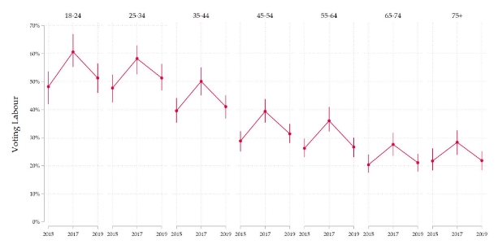
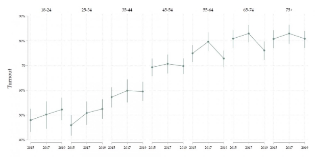

---
title: The July 2024 General Election
date: 2024-06-22 7:00
categories: [Article]
tags: [Politics, Economics, UK]

---

## ( work in progress preview ) The 2024 general election: Is Britain turning a corner or going around a roundabout?

**By Monty** 

**Hucknall**

Today in the United Kingdom we stand before a broken nation. One that struggles from about almost every issue in the economic textbook. Growing Inequality, Stagnant growth, an uptick in unemployment post pandemic, a consistent current account deficit as well as a lack of price stability and a failure of government services due to missing fiscal responsibility. It’s no surprise then that these trends, coupled with a flip-flopping of prime-ministerial leadership has caused a complete shatter in public confidence towards the conservative government.

In order to understand the significance of the election, we must first delve into the society in which it is taking place.

**Age division** 

According to an estimate by the centre for cities the average Brit has £10,200[\[1\]](https://www.centreforcities.org/press/cities-outlook-2024-press-release/#:~:text=Every%20part%20of%20the%20UK,10%2C200%20poorer%20%7C%20Centre%20for%20Cities) less to spend or save on average since 2010 than if the economy had grown at pre-2010 trends. Reduced disposable income coupled with a rampant housing crisis has a chokehold on the younger generation’s ability to succeed and generate wealth and prosperity. 

The House Price to Earnings (HPE) ratio measures how many times greater the average price of a home is, relative to average annual income. In 1983, the average house price to earnings ratio was 3.7[2], but is now an agonising 9.8[2]. Young people are unable to even dream of ever buying a house, since their rent takes up such a large amount of their income that they are unable to even save. Meanwhile the older generation criticises the youth for being too prodigal with their money. 

An unsurprising statistic is that people aged between 18 and 24 were 29%[\[3\]](https://www.britishelectionstudy.com/bes-findings/age-and-voting-behaviour-at-the-2019-general-election/) more likely to vote for labour in 2019 compared to those over the age of 75.It’s well known knowledge that the Labour party has a larger youth demographic of voters than the Conservatives. This is because of the older generation’s nostalgia towards their youth, combined with a fear of change, which pushes them towards more right leaning parties. On the other side of the coin however younger people recognise the value of ripping out rotting institutional bureaucracy in favour of more flexible forward thinking strategies because the institutions were never functional in their lifetime. 

<https://www.britishelectionstudy.com/wp-content/uploads/2021/01/labBayesPlot-1.png> 

*Graph showing labour voting % of age demographic in 2015-2019 elections* 

The reason Labour has not secured an election victory since 2010 is that, despite having a robust voter base, those most inclined to support them (young people) are less likely to participate in voting. As demonstrated in this graph of turnout for those same elections where in 2019 only 53%[\[4\]](https://www.britishelectionstudy.com/bes-findings/age-and-voting-behaviour-at-the-2019-general-election/) of 18 to 24 year olds voted compared to 81%[\[4\]](https://www.britishelectionstudy.com/bes-findings/age-and-voting-behaviour-at-the-2019-general-election/) of people aged 75 and up.

<https://www.britishelectionstudy.com/wp-content/uploads/2021/01/turnoutBayesPlot-1-1536x768.png> 

This highlights the fundamental lack of cohesion between ages in our current democratic position. Young people don’t feel as though their views are properly represented[\[5\]](https://www.bbc.co.uk/news/articles/cxeel1myn13o) and yet the reason for their lack of representation is that their demographic is not considered as important by political parties because of the low turnout. Policy makers make policy for the people who will vote for them and that's why our political landscape is oriented to benefit the elderly.

On the 12 of december 2023 a bill was passed to mandate that voters had to bring a form of photo ID when voting. Whilst this represents another erosion of the “high trust” society there is also a clear bias towards older people when it comes to more informal types of ID. Take a look at the forms of travel cards which are accepted at voting stations.

*From the electoral commission[\[6\]](https://www.electoralcommission.org.uk/voting-and-elections/voter-id/accepted-forms-photo-id)*

- Older Person’s Bus Pass funded by the UK Government (Older People)
- Disabled Person’s Bus Pass funded by the UK Government (Anyone)
- 60+ London Oyster Photocard funded by Transport for London (Older People)
- Freedom Pass (Older People)
- Scottish National Entitlement Card issued for the purpose of concessionary travel (including a 60+, disabled or under 22s bus pass) (Anyone)
- 60 and Over Welsh Concessionary Travel Card (Older People)
- Disabled Person’s Welsh Concessionary Travel Card (Anyone)
- Senior SmartPass issued in Northern Ireland (Older People)
- Registered Blind SmartPass or Blind Person’s SmartPass issued in Northern Ireland (Anyone)
- War Disablement SmartPass issued in Northern Ireland (Anyone)
- 60+ SmartPass issued in Northern Ireland (Older People)
- Half Fare SmartPass issued in Northern Ireland (Younger People)

Notice anything? Why is a 60+ oyster photo card allowed by not a 
